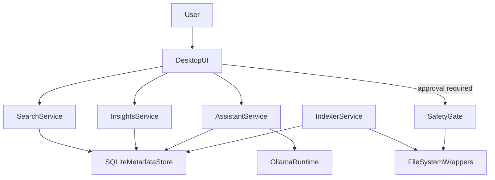

# Architecture Overview

## Product Goal

Deliver local-first file intelligence and organization with strong user trust guarantees:

- No hidden file mutations.
- No auto-delete.
- All mutating actions pass through a safety gate.

## Layered Architecture

1. **Desktop UI (`apps/desktop`)**
   - Electron app shell.
   - Displays search, insights, assistant, and action approvals.
   - Never directly mutates files.

2. **Core Services (`packages/*`)**
   - `indexer`: crawl/watch filesystem and emit metadata updates.
   - `search`: embedding + semantic query.
   - `system-insights`: duplicates, stale files, storage analysis.
   - `ai-assistant`: prompt orchestration and tool routing.

3. **Safety Layer (`packages/safety`)**
   - Enforces preview -> confirm -> execute.
   - Central policy checks and scope validation.
   - Logs intent and result for each mutating action.

4. **Persistence (`packages/shared-db`)**
   - SQLite metadata store.
   - Tracks file records, embedding pointers, actions, rule configs.

5. **Local AI Runtime**
   - Ollama-backed inference for summarization and Q&A.
   - Model outputs are advisory and never directly execute file writes.

## Data Flow (High Level)

## Safety-Critical Invariants

- Every mutating operation has a dry-run preview payload.
- Confirmations are explicit and scoped to specific targets.
- Operation logs are immutable append-only records.
- Automation cannot bypass safety confirmations unless policy explicitly allows it and user has enabled it.
