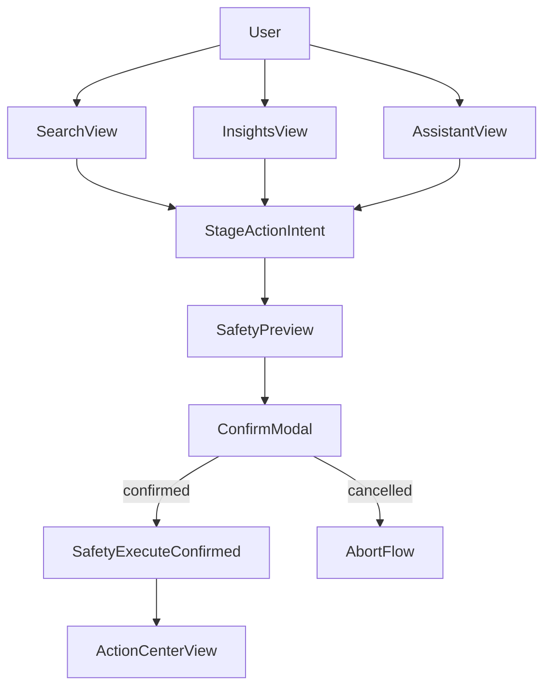

# UI Layout Blueprint

This blueprint defines the initial desktop app information architecture and maps each interaction to backend modules and safety checks.

## Global Navigation

- Home
- Search
- Insights
- Assistant
- Automation
- Action Center
- Settings

## Primary Screen Specifications

## 1) Home

**Purpose**

- Provide system snapshot and quickest path to useful actions.

**Core widgets**

- "Explain my computer" card.
- Storage summary (top folders/types).
- Recent suggestions (dismiss/apply).
- Indexing status banner.

**Module API mapping**

- `system-insights.explainStorage(scope)`
- `ai-assistant.explainComputer(scope)`
- `indexer.getIndexerStatus()`

**Safety checks**

- "Apply suggestion" triggers `safety.preview(actionIntent)` before any confirmation UI.

## 2) Search

**Purpose**

- Natural language and faceted discovery.

**Core widgets**

- Query input with NL examples.
- Facet bar (type/path/recency/size).
- Ranked result list with relevance rationale.
- Result actions: open, reveal, stage action.

**Module API mapping**

- `search.querySemantic(text, filters, limit)`
- `search.queryHybrid(text, filters, limit)`

**Safety checks**

- Any mutating result action routes to staged intent, then `safety.preview`.

## 3) Insights

**Purpose**

- Surface cleanup and organization opportunities.

**Core widgets**

- Tabs: Duplicates, Stale, Large.
- Sort/filter controls.
- Selection and action staging panel.
- Impact estimate panel (`files affected`, `bytes impacted`).

**Module API mapping**

- `system-insights.runDetectors(scope, detectorSet)`
- `system-insights.getFindings(filters)`

**Safety checks**

- Staged actions cannot execute directly.
- "Continue" opens preview modal generated by `safety.preview`.

## 4) Assistant

**Purpose**

- Ask file-aware questions and get suggestions.

**Core widgets**

- Conversation timeline.
- Scope selector (all roots, folder, selected files).
- Citation chips for referenced paths.
- Suggested actions cards.

**Module API mapping**

- `ai-assistant.ask(question, scope)`
- `ai-assistant.summarizeFolder(path, depth)`
- `ai-assistant.suggestOrganization(scope)`

**Safety checks**

- Suggested action button creates action intent only.
- Execution requires `safety.requestConfirmation` and `safety.executeConfirmed`.

## 5) Automation

**Purpose**

- Define and control user-approved organization rules.

**Core widgets**

- Rule list and status badges.
- Rule builder form (scope, trigger, action, constraints).
- Simulation result preview.
- Activate/deactivate controls.

**Module API mapping**

- `automation.createRule(ruleDraft)`
- `automation.simulateRule(ruleId, scope)`
- `automation.activateRule(ruleId)`
- `automation.deactivateRule(ruleId)`

**Safety checks**

- Activation requires preview acknowledgment.
- Rule executions must pass through `safety.validatePolicy` and `safety.preview`.

## 6) Action Center

**Purpose**

- Central place for approvals, execution history, and rollback.

**Core widgets**

- Pending confirmations queue.
- Recent action log with status.
- Rollback actions where supported.
- Error/remediation details.

**Module API mapping**

- `safety.getActionLog(filters)`
- `safety.executeConfirmed(confirmationToken)`
- `safety.rollback(actionId)`

**Safety checks**

- Confirm button displays immutable preview hash before execution.
- Expired confirmation tokens are rejected with re-preview flow.

## Interaction Flow Diagram

## Safety UX Requirements

1. Preview content always includes exact file targets.
2. Confirmation step always includes impact summary and reversible/non-reversible notice.
3. Action Center always shows what happened, by whom, and when.
4. Rollback entry points are shown only when supported by operation type.

## Low-Fidelity Click Path (MVP)

1. Home -> click "Explain my computer".
2. Review insights breakdown -> select a duplicate set.
3. Stage action -> open preview modal.
4. Confirm action -> inspect result in Action Center.
5. Ask assistant to summarize target folder and suggest follow-up organization.
